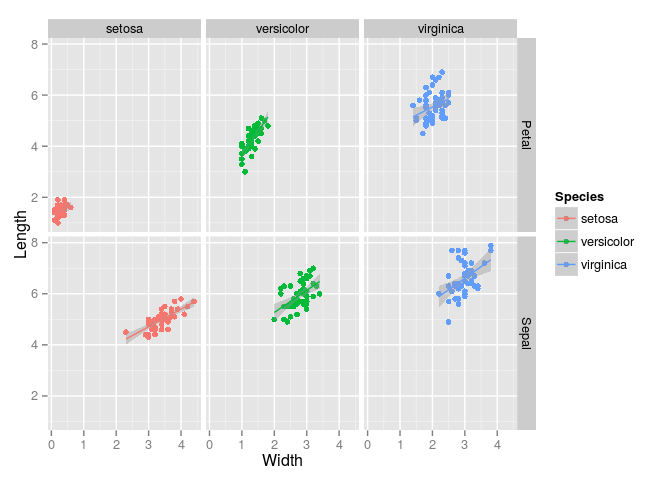
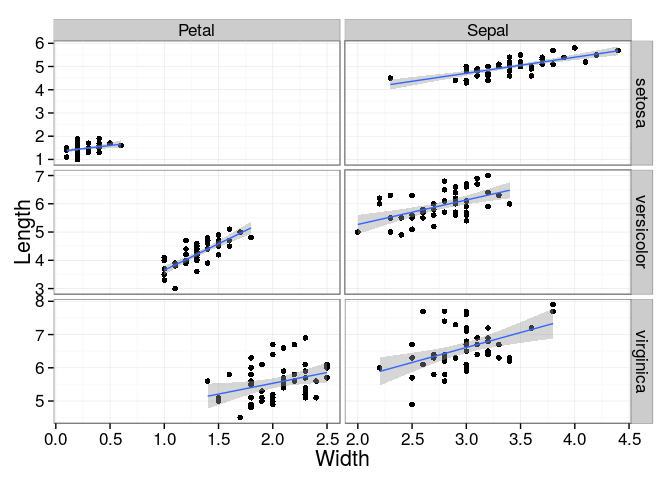

# data.table demo
Brian High  
1/30/2015  

## Load Packages and Data

Load packages.


```r
library(data.table)
library(ggplot2)
```

Load the `iris` data.


```r
data(iris)
head(iris)
```

```
##   Sepal.Length Sepal.Width Petal.Length Petal.Width Species
## 1          5.1         3.5          1.4         0.2  setosa
## 2          4.9         3.0          1.4         0.2  setosa
## 3          4.7         3.2          1.3         0.2  setosa
## 4          4.6         3.1          1.5         0.2  setosa
## 5          5.0         3.6          1.4         0.2  setosa
## 6          5.4         3.9          1.7         0.4  setosa
```

Convert to a `data.table`.


```r
irisdt <- as.data.table(iris)
head(irisdt)
```

```
##    Sepal.Length Sepal.Width Petal.Length Petal.Width Species
## 1:          5.1         3.5          1.4         0.2  setosa
## 2:          4.9         3.0          1.4         0.2  setosa
## 3:          4.7         3.2          1.3         0.2  setosa
## 4:          4.6         3.1          1.5         0.2  setosa
## 5:          5.0         3.6          1.4         0.2  setosa
## 6:          5.4         3.9          1.7         0.4  setosa
```

## Prepare for Reshaping

Add a column for the flower id.


```r
irisdt[, flower_id := as.numeric(rownames(iris))]
head(irisdt)
```

```
##    Sepal.Length Sepal.Width Petal.Length Petal.Width Species flower_id
## 1:          5.1         3.5          1.4         0.2  setosa         1
## 2:          4.9         3.0          1.4         0.2  setosa         2
## 3:          4.7         3.2          1.3         0.2  setosa         3
## 4:          4.6         3.1          1.5         0.2  setosa         4
## 5:          5.0         3.6          1.4         0.2  setosa         5
## 6:          5.4         3.9          1.7         0.4  setosa         6
```

## Reshape with `melt` and `dcast`

Convert wide data format to long format.


```r
irisdt_melted <- melt(irisdt, 
                      id = c("flower_id", "Species"), 
                      measure = c("Sepal.Length", "Sepal.Width", 
                                  "Petal.Length", "Petal.Width"))
head(irisdt_melted)
```

```
##    flower_id Species     variable value
## 1:         1  setosa Sepal.Length   5.1
## 2:         2  setosa Sepal.Length   4.9
## 3:         3  setosa Sepal.Length   4.7
## 4:         4  setosa Sepal.Length   4.6
## 5:         5  setosa Sepal.Length   5.0
## 6:         6  setosa Sepal.Length   5.4
```

Add new columns for the parsed values. Remove the variable column.


```r
irisdt_melted[, flower_part := gsub("(\\w*)\\.\\w*", "\\1", variable)]
irisdt_melted[, measurement_type := gsub("\\w*\\.(\\w*)", "\\1", variable)]
irisdt_melted[, variable := NULL]
head(irisdt_melted)
```

```
##    flower_id Species value flower_part measurement_type
## 1:         1  setosa   5.1       Sepal           Length
## 2:         2  setosa   4.9       Sepal           Length
## 3:         3  setosa   4.7       Sepal           Length
## 4:         4  setosa   4.6       Sepal           Length
## 5:         5  setosa   5.0       Sepal           Length
## 6:         6  setosa   5.4       Sepal           Length
```

Convert `measurement_type` to columns in wide format.


```r
irisdt_dcast <- dcast(irisdt_melted, 
                     formula=flower_id+Species+flower_part~measurement_type)
head(irisdt_dcast)
```

```
##    flower_id Species flower_part Length Width
## 1:         1  setosa       Petal    1.4   0.2
## 2:         1  setosa       Sepal    5.1   3.5
## 3:         2  setosa       Petal    1.4   0.2
## 4:         2  setosa       Sepal    4.9   3.0
## 5:         3  setosa       Petal    1.3   0.2
## 6:         3  setosa       Sepal    4.7   3.2
```

## Plot with `qplot`

Produce faceted plot with ggplot2's `qplot`.


```r
qplot(x=Width, y=Length, data=irisdt_dcast, geom=c("point","smooth"), 
      color=Species, method="lm", facets=flower_part~Species)
```

 

## Plot with `ggplot`

Produce a faceted plot with ggplot2's `ggplot` instead of `qplot`.


```r
ggplot(data=irisdt_dcast, aes(x=Width, y=Length)) + 
    geom_point() + facet_grid(Species~flower_part, scale="free") +
    geom_smooth(method="lm") + theme_bw(base_size=16)
```

 
