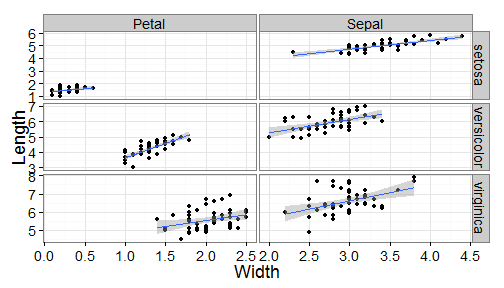

# dplyr and tidyr demonstration
Brian High and Raphael Gottardo  
Jan. 14th, 2015  


## Load packages and data
Load ggplot2 and iris data.


```r
suppressMessages(library(ggplot2))
data(iris)
```

Load dplyr and tidyr.


```r
suppressMessages(library(dplyr))
suppressMessages(library(tidyr))
```

## Add id column to data table
Add a column to keep track of the flower id.


```r
iris_id <- mutate(iris, flower_id = rownames(iris))
head(iris_id)
```

```
##   Sepal.Length Sepal.Width Petal.Length Petal.Width Species flower_id
## 1          5.1         3.5          1.4         0.2  setosa         1
## 2          4.9         3.0          1.4         0.2  setosa         2
## 3          4.7         3.2          1.3         0.2  setosa         3
## 4          4.6         3.1          1.5         0.2  setosa         4
## 5          5.0         3.6          1.4         0.2  setosa         5
## 6          5.4         3.9          1.7         0.4  setosa         6
```

## dplyr and tidyr: gather
Convert wide data format to long format.


```r
iris_gathered <- gather(iris_id, variable, value, c(-Species, -flower_id))
head(iris_gathered)
```

```
##   Species flower_id     variable value
## 1  setosa         1 Sepal.Length   5.1
## 2  setosa         2 Sepal.Length   4.9
## 3  setosa         3 Sepal.Length   4.7
## 4  setosa         4 Sepal.Length   4.6
## 5  setosa         5 Sepal.Length   5.0
## 6  setosa         6 Sepal.Length   5.4
```

## dplyr and tidyr: mutate and gsub
Add new columns for the parsed values, remove the variable column.


```r
iris_parsed <- mutate(iris_gathered, 
                      flower_part = gsub("(\\w*)\\.\\w*", "\\1", variable), 
                      measurement_type = gsub("\\w*\\.(\\w*)", "\\1", variable),
                      variable = NULL)
head(iris_parsed)
```

```
##   Species flower_id value flower_part measurement_type
## 1  setosa         1   5.1       Sepal           Length
## 2  setosa         2   4.9       Sepal           Length
## 3  setosa         3   4.7       Sepal           Length
## 4  setosa         4   4.6       Sepal           Length
## 5  setosa         5   5.0       Sepal           Length
## 6  setosa         6   5.4       Sepal           Length
```

## dplyr and tidyr: spread
Convert measurement_types to columns in wide format.


```r
iris_spread <- spread(iris_parsed, measurement_type, value)
head(iris_spread)
```

```
##   Species flower_id flower_part Length Width
## 1  setosa         1       Petal    1.4   0.2
## 2  setosa         1       Sepal    5.1   3.5
## 3  setosa        10       Petal    1.5   0.1
## 4  setosa        10       Sepal    4.9   3.1
## 5  setosa        11       Petal    1.5   0.2
## 6  setosa        11       Sepal    5.4   3.7
```

## Plot with ggplot2's `qplot`
Produce faceted plot with ggplot2's `qplot`.


```r
qplot(x=Width, y=Length, data=iris_spread, geom=c("point","smooth"), 
      color=Species, method="lm", facets= flower_part~Species)
```

 

## Repeat using a pipe
All of the data tidying could be done in one "pipe line".


```r
iris_spread <- mutate(iris, flower_id = rownames(iris)) %>%
    gather(variable, value, c(-Species, -flower_id)) %>%
    mutate(flower_part = gsub("(\\w*)\\.\\w*", "\\1", variable), 
           measurement_type = gsub("\\w*\\.(\\w*)", "\\1", variable),
           variable = NULL) %>%
    spread(measurement_type, value)
```

## Plot with ggplot2's `qplot` again
Produce the faceted plot again with ggplot2's `qplot`.


```r
qplot(x=Width, y=Length, data=iris_spread, geom=c("point","smooth"), 
      color=Species, method="lm", facets= flower_part~Species)
```

 

## Plot with `ggplot`
Produce a faceted plot with `ggplot2` instead of `qplot`.


```r
ggplot(data=iris_spread, aes(x=Width, y=Length))+ 
    # Add points and use free scales in the facet
    geom_point()+facet_grid(Species~flower_part, scale="free")+
    # Add a regression line
    geom_smooth(method="lm")+
    # Use the black/white theme and increase the font size
    theme_bw(base_size=18)
```

 

